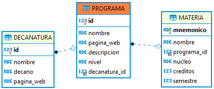

## Escuela Colombiana de Ingeniería

### CVDS – Ciclos de Vida del desarrollo de Software
### Parcial Segundo Tercio


**IMPORTANTE**

* Se puede consultar en la Web: APIs/Documentación de lenguaje y frameworks (Primefaces, Guice, MyBatis, etc), y enunciados de los laboratorios (se pueden revisar los fuentes incluidos con los dichos enunciados).
* No se permite: Usar memorias USB, acceder a redes sociales, clientes de correo, o sistemas de almacenamiento en la nube (Google Drive, DropBox, etc). El uso de éstos implicará anulación.
* Clone el proyecto con GIT, NO lo descargue directamente.
* El filtrado y ordenamiento de los datos DEBE realizarse en el motor de base de datos, a través del uso de SQL. Consultar todos los datos y filtrarlos en el servidor de aplicaciones -que es supremamente INEFICIENTE- se evaluará como INCORRECTO.


Se le han dado los fuentes de un avance parcial de una plataforma para la administración del contenido educativo de la Escuela. En esta plataforma los usuarios podrán revisar el contenido educativo de la Escuela así como registrarse para distintos cursos.
Adicionalmente, hay un usuario administrador del sistema que puede hacer modificaciones a la información almacenada.

Para el Sprint en curso, se han seleccionado las siguientes historias de usuario del Backlog de producto:

Recuerde que en el formato XML no se puede utilizar '<' y '>', por ejemplo al realizar comparaciones, utilice '&amp;lt;' o '&amp;gt;' respectivamente. 

## Historia de usuario #1

  > **Como** Usuario de la plataforma de la Escuela
  >
  > **Quiero** Poder consultar las materias de un programa específico.
  >
  > **Para** Obtener la información de las materias disponibles en el programa.
  >
  > **Criterio de aceptación:** Se debe mostrar el mnemónico, nombre completo, núcleo al que pertenece, semestre sugerido y número de créditos de la materia. Las materias deben estar organizadas por semestre y luego por mnemónico.


## Historia de usuario #2

  > **Como** Usuario de la plataforma
  >
  > **Quiero** Poder realizar una búsqueda de la materia por palabras similares al nombre.
  >
  > **Para** Conocer con rapidez la información específica de una materia en particular.
  >
  > **Criterio de aceptación:** La consulta por "similares" debe coincidir si el nombre incluye la palabra especificada sin importar mayúsculas o minúsculas, ni la ubicación de la misma en el nombre. El reporte debe contener la misma información del reporte anterior donde se muestran las materias.

# Modelo 

El modelo de base de datos y de clases asociados a la implementación parcial son los siguientes:




A partir de la aplicación base suministrada, debe realizar lo siguiente:


1.  (20%) A partir de la especificación hecha en los métodos `buscarMateriasPorPrograma` y `buscarMateriasPorSimilares` de la fachada de servicios (la parte lógica de la aplicación), implemente sólo una prueba (la que considere más importante para validar las especificaciones y los criterios de aceptación). Siga el esquema usado en `DecanaturaServicesTest` para poblar la base de datos volátil y verificar el comportamiento de las operaciones de la lógica.

2.  (40%) Implemente la historia de usuario #1, agregando todo lo que haga falta en la capa de presentación, lógica y de persistencia. La vista debe implementarse en `materia.xhtml`: Dados una decanatura y un programa, mostrar las materias disponibles en el plan de estudios de la Escuela.

3.  (40%) Implemente la historia de usuario #2, agregando todo lo que haga falta en la capa de presentación, lógica y de persistencia. La vista se puede implementar en donde mejor considere que debería quedar: Mostrar el reporte de las materias que coinciden con la palabra clave.


## Entrega

Siga al pie de la letra estas indicaciones para la entrega del examen. EL HACER CASO OMISO DE ESTAS INSTRUCCIONES PENALIZARÁ LA NOTA.

1. Limpie el proyecto

	```bash
	$ mvn clean
	```

2. Configure su usuario de GIT

	```bash
	$ git config --global user.name "Juan Perez"
	$ git config --global user.email juan.perez@mail.escuelaing.edu.co
	```

3. Desde el directorio raíz (donde está este archivo README.md), haga commit de lo realizado.

	```bash
	$ git add .
	$ git commit -m "entrega parcial - Juan Perez"
	```


4. Desde este mismo directorio, comprima todo con: (no olvide el punto al final en la segunda instrucción)

	```bash
	$ zip -r APELLIDO.NOMBRE.zip .
	```

4. Abra el archivo ZIP creado, y rectifique que contenga lo desarrollado.

5. Suba el archivo antes creado (APELLIDO.NOMBRE.zip) en el espacio de moodle correspondiente.

6. ¡IMPORTANTE! Conserve una copia de la carpeta y del archivo .ZIP.


<!-- ## Bono 
Si después de realizado el parcial, de forma INDIVIDUAL encuentra defectos menores (que impliquen a lo sumo cambiar 5 líneas de código), y que al corregirlos permiten que los puntos 2 o 3 funcionen:
1. Haga los ajustes en su código.
2. Haga un nuevo commit con el mensaje "entrega bono, ahora funciona el Punto XX" , donde XX es el punto que se corrigió. 
3. Ejecute:

    ```bash
	    $ git diff --stat HEAD HEAD^^
    ```

4. Si el resultado del comando anterior es menor o igual a 10, puede aplicar al bono.
5. Comprima la nueva versión siguiendo el esquema indicado en el parcial, y envíelo por correo a más tardar el 27 de Marzo a las 11:59pm.
-->
